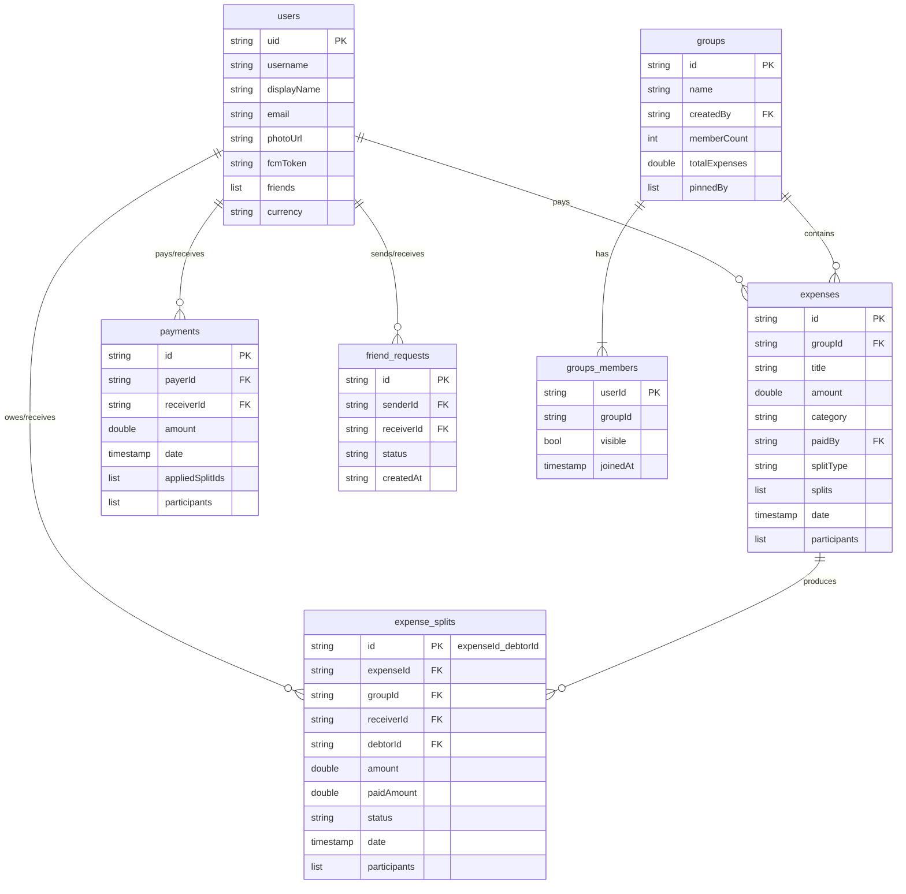

# ShareMate — Full-Stack Audit Report

> **Scope:** 75 source files · ~760 KB · Flutter 3.11 + Firebase (Auth, Firestore, Storage, Messaging)
> **Date:** May 26 2025

---

## Executive Summary

| Area | Grade | Verdict |
|------|:-----:|---------|
| **Architecture & Layering** | **B+** | Clean feature-first structure with proper repository/controller separation. Missing a few cross-cutting concerns. |
| **Code Quality** | **B** | 0 lint errors. Consistent patterns, good error handling. Some God-files and duplication. |
| **Firestore Schema & Backend** | **B−** | Schema is well-normalised for Firestore. Missing composite indexes, security rules, and TTL cleanup. |
| **Scalability** | **C+** | Will work well for ~1K–5K users. Has several Firestore anti-patterns that will break at 10K+ users. |
| **Security** | **C** | No Firestore security rules checked into the repo. Several client-side-only trust boundaries. |
| **Testing** | **C−** | Model tests exist. No repository/controller integration tests. No widget golden tests. |

---

## 1. Architecture & Layering

### What's Good ✅

```
lib/
├── core/          # Router, theme, colors — clean cross-cutting
├── models/        # 8 pure data classes — no business logic leakage
├── providers/     # Repository + Controller pairs — proper separation
├── features/      # Feature-first UI screens with local widgets/
└── widgets/       # 7 shared reusable widgets
```

- **Repository/Controller pattern** is consistently applied across all 4 domains (Auth, Expenses, Friends, Groups).
- **Riverpod** is used correctly — `Provider` for repositories, `AsyncNotifierProvider` for controllers, `StreamProvider` for real-time data.
- **GoRouter with `StatefulShellRoute`** — correct use of `_FadeIndexedStack` for tab persistence.
- **Clean routing guards** — `isRegisteringProvider` and `isDeletingAccountProvider` prevent auth-race flashes. This is industry-grade.

### What Needs Improvement ⚠️

| Issue | Severity | Location |
|-------|----------|----------|
| **No error/exception classes** — all errors are raw `Exception('string')` | Medium | All repositories |
| **No logging layer** — no `Logger`, `Crashlytics`, or structured logging | Medium | Entire app |
| **No `constants.dart`** — collection names like `'users'`, `'expenses'`, `'friend_requests'` are raw strings scattered everywhere | Medium | All repositories |
| **No environment config** — Firebase project ID is hardcoded; no dev/staging/prod separation | Low | [firebase.json](file:///d:/Umair%20WorkPlace/ShareMate/sharemate_app/firebase.json) |

### Recommendations

1. **Create `core/constants/firestore_paths.dart`** with:
   ```dart
   abstract class FirestorePaths {
     static const users = 'users';
     static const expenses = 'expenses';
     static const expenseSplits = 'expense_splits';
     static const payments = 'payments';
     static const friendRequests = 'friend_requests';
     static const groups = 'groups';
     static String groupMembers(String groupId) => 'groups/$groupId/members';
   }
   ```

2. **Create typed exception classes:**
   ```dart
   class ShareMateException implements Exception {
     final String message;
     final String? code;
     ShareMateException(this.message, {this.code});
   }
   class AuthException extends ShareMateException { ... }
   class ValidationException extends ShareMateException { ... }
   ```

3. **Add a `core/logging/` layer** using `package:logger` or Firebase Crashlytics.

---

## 2. Code Quality

### Static Analysis: ✅ 0 Issues

```
flutter analyze → No issues found!
```

### Strengths ✅

- **Consistent naming** — providers follow `xxxProvider`, controllers `xxxControllerProvider`, repositories `xxxRepositoryProvider`.
- **Immutable models** — all model fields are `final`, constructors use `required`.
- **Null safety** — proper use of `??`, null-aware operators, and safe fallbacks in `fromMap()`.
- **Batch operations** — `WriteBatch` used correctly in friends, groups, and expenses for atomic multi-doc writes.
- **Transactions** — `settleSplit` uses Firestore transactions properly to prevent race conditions.
- **Timestamp handling** — all models handle `Timestamp`, `DateTime`, and `String` date formats defensively.

### Issues ⚠️

| Issue | Severity | Files |
|-------|----------|-------|
| **God files** — 6 files exceed 500 lines, 3 exceed 800 lines | High | [friends_screen.dart](file:///d:/Umair%20WorkPlace/ShareMate/sharemate_app/lib/features/friends/friends_screen.dart) (1074), [group_member_widgets.dart](file:///d:/Umair%20WorkPlace/ShareMate/sharemate_app/lib/features/groups/widgets/group_member_widgets.dart) (1039), [groups_screen.dart](file:///d:/Umair%20WorkPlace/ShareMate/sharemate_app/lib/features/groups/groups_screen.dart) (907) |
| **Duplicated payment recording logic** — `recordPaymentAgainstPendingSplits` and `recordPaymentAgainstSelectedSplits` share ~80% identical code | Medium | [expenses_repository.dart:475-692](file:///d:/Umair%20WorkPlace/ShareMate/sharemate_app/lib/providers/expenses_repository.dart#L475-L692) |
| **Direct `FirebaseFirestore.instance` access in providers** — bypasses the repository pattern | Medium | [user_provider.dart:9](file:///d:/Umair%20WorkPlace/ShareMate/sharemate_app/lib/providers/user_provider.dart#L9), [user_provider.dart:28](file:///d:/Umair%20WorkPlace/ShareMate/sharemate_app/lib/providers/user_provider.dart#L28), [user_provider.dart:48](file:///d:/Umair%20WorkPlace/ShareMate/sharemate_app/lib/providers/user_provider.dart#L48) |
| **System events stored in `expenses` collection** — group creation, member add/remove events are fake `ExpenseModel` entries with `category: 'system'` and `amount: 0` | Medium | [groups_repository.dart:112-157](file:///d:/Umair%20WorkPlace/ShareMate/sharemate_app/lib/providers/groups_repository.dart#L112-L157) |
| **Hardcoded colors in UI** — most screens use inline `Colors.grey.shade50`, `Colors.white`, etc. instead of theme tokens | Low | All feature screens |
| **`ignore: use_build_context_synchronously`** globally suppressed in analysis_options | Low | [analysis_options.yaml:12](file:///d:/Umair%20WorkPlace/ShareMate/sharemate_app/analysis_options.yaml#L12) |

### Recommendations

1. **Split God files** — Extract widget methods like `_buildRequestTile()`, `_buildFriendTile()` into dedicated widget files under each feature's `widgets/` folder. Target: **< 400 lines per file**.

2. **Extract shared payment logic** — Create a private `_applyPaymentToLedgers(...)` method that both `recordPaymentAgainstPendingSplits` and `recordPaymentAgainstSelectedSplits` call.

3. **Move `userProfileProvider` Firestore access** into `AuthRepository` — it already has `getUserData(uid)`. Replace:
   ```dart
   // ❌ Current
   final doc = await FirebaseFirestore.instance.collection('users').doc(uid).get();
   // ✅ Better
   final user = await ref.watch(authRepositoryProvider).getUserData(uid);
   ```

4. **Separate system events** — Use a dedicated `group_events` subcollection instead of injecting fake expenses.

---

## 3. Firestore Schema & Backend Design

### Current Schema Map



### What's Good ✅

- **Denormalized `expense_splits` collection** — brilliant for querying debts independently without loading full expense docs.
- **Deterministic split IDs** (`expenseId_debtorId`) — prevents duplicates and enables efficient lookups.
- **`participants` array on expenses and payments** — enables `arrayContains` queries for any user, avoiding fan-out reads.
- **`visible` flag on group members** — soft-delete pattern preserves historical data while hiding departed members.
- **`pinnedBy` + `pinnedAtBy` on groups** — per-user pinning without per-user subcollections.
- **`memberCount` atomic increment** — avoids reading all members just to get the count.

### Issues ⚠️

| Issue | Severity | Impact |
|-------|----------|--------|
| **No Firestore security rules in the repo** | 🔴 Critical | Anyone with the Firebase config can read/write ANY data |
| **`friends` list stored on user doc** — grows unbounded | High | At 500+ friends, every profile read transfers the entire array |
| **No composite indexes defined** — queries like `where('receiverId') + where('status') + orderBy('date')` require composite indexes | High | Will fail in production without manual index creation |
| **`collectionGroup('members')` query** — used for both getUserGroups and deleteAccount cleanup | Medium | Requires a [collectionGroup index](https://firebase.google.com/docs/firestore/query-data/queries#collection-group-query) on `members` |
| **No TTL/cleanup for rejected friend requests** — `status: 'rejected'` docs accumulate forever | Medium | Storage grows linearly, queries slow down |
| **`createdAt` on `friend_requests` uses ISO string instead of `Timestamp`** | Low | Inconsistent with every other model; can't use server-time ordering |

### Required Firestore Indexes

These composite indexes MUST be created for the app to work at scale:

```
# expense_splits
(receiverId ASC, status ASC, date DESC)
(debtorId ASC, status ASC, date DESC)
(debtorId ASC, receiverId ASC, status ASC, date ASC)

# expenses
(participants ARRAY, date DESC)
(groupId ASC, date DESC)

# friend_requests
(senderId ASC, receiverId ASC)
(receiverId ASC, status ASC)
(senderId ASC, status ASC)

# collectionGroup: members
(userId ASC, visible ASC)

# payments
(participants ARRAY, date DESC)
```

---

## 4. Scalability Assessment

### Current Capacity Estimate

| Metric | Current Design Supports | Bottleneck |
|--------|:-----------------------:|------------|
| Users | ~5,000 | `friends` array on user doc grows unbounded |
| Expenses per user | ~10,000 | No pagination on `getUserExpenses` stream |
| Groups per user | ~100 | `collectionGroup` query + client-side group fetch |
| Payment history | ✅ Paginated | `getUserPaymentsPage` uses cursor-based pagination |
| Friends per user | ~200 | Array size in user doc + `whereIn` 10-chunk limit |

### Critical Scalability Bugs 🔴

1. **`getUserExpenses` loads ALL expenses into memory via a stream**
   - File: [expenses_repository.dart:177-191](file:///d:/Umair%20WorkPlace/ShareMate/sharemate_app/lib/providers/expenses_repository.dart#L177-L191)
   - A user with 5,000 expenses will download ALL of them on every Home Screen load.
   - **Fix:** Add `.limit(50)` and implement cursor-based pagination like `getUserPaymentsPage`.

2. **`getUserGroups()` does N+1 reads**
   - File: [groups_repository.dart:160-246](file:///d:/Umair%20WorkPlace/ShareMate/sharemate_app/lib/providers/groups_repository.dart#L160-L246)
   - First queries `collectionGroup('members')` → gets group IDs → then does `where(FieldPath.documentId, whereIn: chunk)` for each batch of 10.
   - A user in 50 groups = 1 collectionGroup read + 5 group batch reads = **6 Firestore reads per screen load**.
   - This is acceptable but consider caching with `keepAlive`.

3. **`searchUsers` does 2 sequential queries (username + email)**
   - File: [friends_repository.dart:25-53](file:///d:/Umair%20WorkPlace/ShareMate/sharemate_app/lib/providers/friends_repository.dart#L25-L53)
   - No prefix search — only exact match. Users must type the complete username.
   - **Fix:** Add a `searchKeywords` array field and use `arrayContainsAny` for prefix search, or use Algolia/Typesense.

4. **Analytics fetches ALL user expenses client-side**
   - File: [analytics_provider.dart:165-188](file:///d:/Umair%20WorkPlace/ShareMate/sharemate_app/lib/providers/analytics_provider.dart#L165-L188)
   - `_computeAnalytics` processes every expense in-memory. At 10K expenses this will cause ANRs.
   - **Fix:** Use Cloud Functions to pre-aggregate monthly totals, or use Firestore aggregation queries.

5. **`deleteAccount` batch can exceed 500 operations**
   - File: [auth_repository.dart:80-177](file:///d:/Umair%20WorkPlace/ShareMate/sharemate_app/lib/providers/auth_repository.dart#L80-L177)
   - Firestore batches are limited to 500 operations. A power user with 200 friends + 50 groups + 100 friend requests can exceed this.
   - **Fix:** Split into multiple batches or use a Cloud Function.

---

## 5. Security Audit

### 🔴 Critical: No Firestore Security Rules

There are **no `firestore.rules`** checked into this repository. This means either:
- Rules are deployed manually (fragile, easy to forget)
- The default permissive rules are in use (anyone can read/write everything)

> [!CAUTION]
> Without proper security rules, **any user can read other users' private data, modify expenses they don't own, delete other users' accounts from Firestore, and impersonate other users.**

### Minimum Required Rules

```javascript
rules_version = '2';
service cloud.firestore {
  match /databases/{database}/documents {
    // Users: read any profile, write only your own
    match /users/{userId} {
      allow read: if request.auth != null;
      allow create: if request.auth.uid == userId;
      allow update: if request.auth.uid == userId;
      allow delete: if request.auth.uid == userId;
    }
    
    // Expenses: only participants can read/write
    match /expenses/{expenseId} {
      allow read: if request.auth.uid in resource.data.participants;
      allow create: if request.auth.uid == request.resource.data.paidBy;
      allow update: if request.auth.uid == resource.data.paidBy;
    }
    
    // Friend requests: sender or receiver only
    match /friend_requests/{requestId} {
      allow read: if request.auth.uid == resource.data.senderId
                  || request.auth.uid == resource.data.receiverId;
      allow create: if request.auth.uid == request.resource.data.senderId;
      allow update: if request.auth.uid == resource.data.receiverId;
    }
    
    // Groups: members only
    match /groups/{groupId} {
      allow read: if request.auth != null;
      allow create: if request.auth.uid == request.resource.data.createdBy;
      allow update: if request.auth != null; // Tighten per field
      
      match /members/{memberId} {
        allow read: if request.auth != null;
        allow write: if request.auth != null; // Tighten to admin
      }
    }
  }
}
```

### Other Security Concerns

| Issue | Severity |
|-------|----------|
| **All financial logic runs client-side** — expense creation, split calculation, payment recording. A malicious client can forge any values. | High |
| **No server-side validation** — the app trusts `amount`, `splits`, and `paidBy` from the client without validation | High |
| **No rate limiting** — a user can send unlimited friend requests | Medium |
| **Password reset checks email existence first** — [auth_repository.dart:63-70](file:///d:/Umair%20WorkPlace/ShareMate/sharemate_app/lib/providers/auth_repository.dart#L63-L70) leaks whether an email is registered (user enumeration attack) | Medium |
| **`uuid` package imported but never used** — dead dependency | Low |

---

## 6. Testing

### Current Coverage

| Layer | Tests | Verdict |
|-------|:-----:|---------|
| Models | ✅ 5 test files | Good — covers serialization round-trips |
| Providers/Analytics | ✅ 1 test file | Partial — only analytics computation |
| Widgets | ✅ 6 test files | Partial — no golden tests, some structural tests |
| Repositories | ❌ 0 | **Missing** — no mocked Firestore tests |
| Controllers | ❌ 0 | **Missing** — no state mutation tests |
| Integration (E2E) | ❌ 0 | **Missing** — no flow tests |

### Recommendations

1. **Add repository unit tests** with `fake_cloud_firestore` package — test `addExpense`, `settleSplit`, `deleteAccount`.
2. **Add controller tests** — mock repositories, verify `AsyncValue` state transitions.
3. **Add golden screenshot tests** for key screens (Home, Groups, Settings).

---

## 7. Prioritized Action Items

### 🔴 P0 — Do Before Launch

| # | Action | Effort |
|---|--------|--------|
| 1 | **Write and deploy Firestore security rules** | 2-3 hours |
| 2 | **Create `firestore.indexes.json`** with all required composite indexes | 1 hour |
| 3 | **Add `.limit()` to `getUserExpenses` stream** to prevent OOM on power users | 30 min |
| 4 | **Split `deleteAccount` batch** into multiple batches (max 500 ops each) | 1 hour |
| 5 | **Remove email-existence check** from password reset flow (user enumeration) | 15 min |

### 🟡 P1 — Do Before Scale (1K+ Users)

| # | Action | Effort |
|---|--------|--------|
| 6 | Move **friends list to subcollection** `users/{uid}/friends/{friendId}` instead of array | 3-4 hours |
| 7 | **Pre-aggregate analytics** via Cloud Functions (monthly totals, category sums) | 4-6 hours |
| 8 | Add **prefix search** for user discovery (searchKeywords array or Algolia) | 2-3 hours |
| 9 | **Move system events** out of `expenses` into `groups/{id}/events` subcollection | 2 hours |
| 10 | Add **Cloud Functions** for sensitive operations (expense creation validation, payment recording) | 6-8 hours |

### 🟢 P2 — Code Quality Improvements

| # | Action | Effort |
|---|--------|--------|
| 11 | **Split God files** (friends_screen, group_member_widgets, groups_screen) | 3-4 hours |
| 12 | Create **`FirestorePaths` constants** and typed exception classes | 1 hour |
| 13 | Consolidate **duplicated payment logic** in expenses_repository | 1 hour |
| 14 | Route all Firestore access through repositories (fix user_provider) | 1 hour |
| 15 | Add **repository + controller unit tests** | 4-6 hours |
| 16 | Add **structured logging** with Crashlytics integration | 2 hours |
| 17 | Replace hardcoded colors with **theme tokens** (`Theme.of(context)`) | 2-3 hours |
| 18 | Use ISO `Timestamp` in `friend_requests` instead of ISO string | 30 min |

---

## 8. Dependency Audit

| Package | Version | Status | Notes |
|---------|---------|:------:|-------|
| flutter_riverpod | ^3.3.1 | ✅ Current | |
| go_router | ^17.2.3 | ✅ Current | |
| firebase_core | ^4.9.0 | ✅ Current | |
| firebase_auth | ^6.5.1 | ✅ Current | |
| cloud_firestore | ^6.4.1 | ✅ Current | |
| firebase_storage | ^13.4.1 | ⚠️ Unused | Not imported anywhere in lib/ — remove |
| firebase_messaging | ^16.2.2 | ⚠️ Unused | `fcmToken` field exists but no push notification code — remove or implement |
| cached_network_image | ^3.4.1 | ✅ Used | For avatar loading |
| fl_chart | ^1.2.0 | ✅ Used | Analytics charts |
| intl | ^0.20.2 | ✅ Used | Date formatting |
| uuid | ^4.5.3 | ⚠️ Unused | Not imported anywhere — Firestore auto-IDs are used instead |
| shimmer | ^3.0.0 | ✅ Used | Loading skeletons |

> [!TIP]
> Remove `firebase_storage`, `firebase_messaging`, and `uuid` from `pubspec.yaml` to reduce app size and build time. Re-add them when you actually implement those features.

---

## 9. Overall Verdict

**ShareMate is a well-architected app for an early-stage product.** The repository/controller pattern, Riverpod usage, and Firestore batch/transaction patterns demonstrate solid engineering. The code is clean, passes all lints, and the UI layer is well-organized with proper widget extraction.

**However, it is NOT production-ready for public launch** due to:
1. Missing Firestore security rules (anyone can read/write anything)
2. No query limits on expense streams (will crash at scale)
3. Client-side-only financial logic (can be exploited)
4. No composite indexes defined (queries will fail)

**Estimated effort to reach production-grade:** ~20-30 hours of focused work on P0 + P1 items.

The foundation is strong — the improvements are additive, not architectural rewrites.
